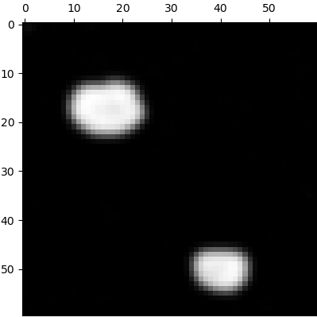
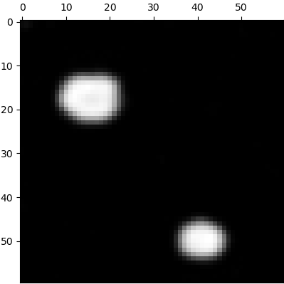
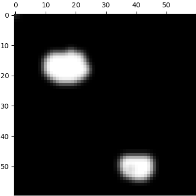
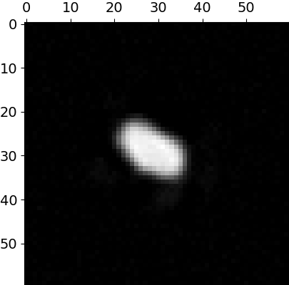
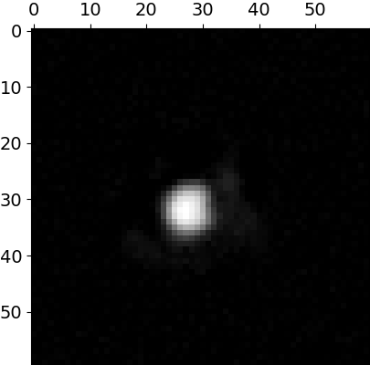
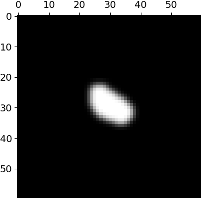
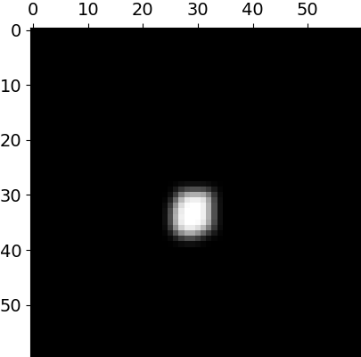
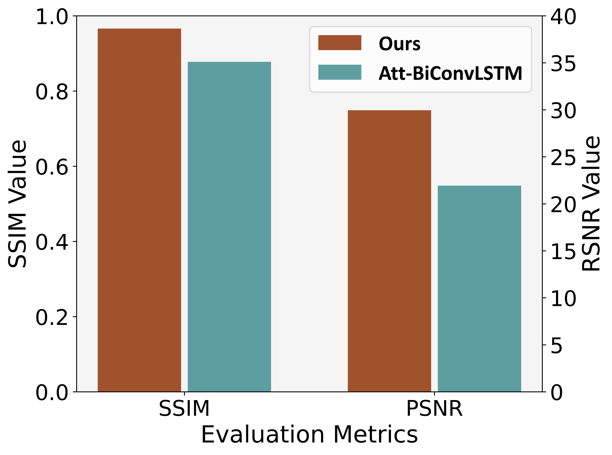
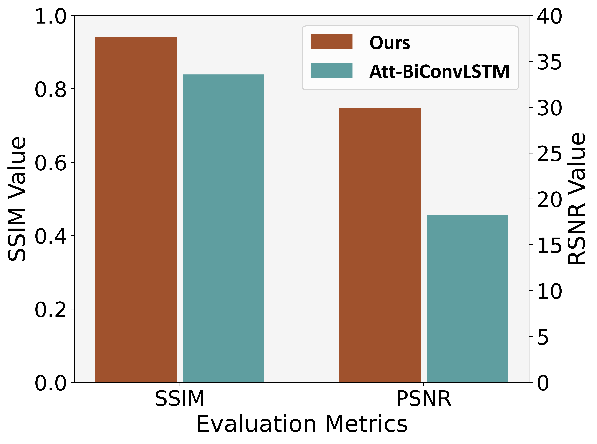

# GPRS
We introduce GPRS, a data-driven model designed for below-ground biomass sensing. GPRS is capable of sensing the blow-ground biomass, including sizes, shapes and positions, through radio tomographic imaging. We extensively evaluate GPRS's sensing capabilities and validate its effectiveness in multiple scenarios, including multiple underground potato tubers, random positions, different soils with different moisture, leave-k-out potato tubers and domain adaptation(crossing soils and crossing environments). 

We have released several pre-trained models and part of the corresponding data files in releases, which can be used for performance testing. 

## 1. Visualization Results
Some visualization results of GPRS are shown as follows. For demonstration purposes, we provide the imaging results in the dual-potato tubers scenario, the random positions scenario, and the leave-k-out potato tubers scenario, which are representative of underground biomass sensing. Please note that the pixel size of all generated results is 1cm, and the monitored size is configured as 60cm $\times$ 60cm. 

|               | Predicted Result|Ground Truth|
| ------------- | -------------| -------------   |
|Dual-potato tubers|<div align=center></div>  <div align=center></div>|<div align=center></div>  <div align=center></div>|
|Random positions|<div align=center></div>  <div align=center></div>|<div align=center></div>  <div align=center></div>|

As shown, GPRS generates images that accurately demonstrate sizes, shapes and positions. 

## Prerequisite and Evaluation
### 2.1 Prerequisite
GPRS is implemented with Python 3.8 and PyTorch 1.9.1. We manage the development environment using Conda. Execute the following commands to configure the development environment. 

- Create a conda environment called GPRS based on python 3.8, and activate the environment.
     ```python
    conda create -n GPRS python=3.8
    conda activate GPRS 
    ```
- Install PyTorch, as well as other required packages,
  ```python
    pip3 install torch
    pip3 install install opencv-python
    pip3 install
    pip3 install scikit-learn
    pip3 install scikit-image
  ```
- Download or git clone the GPRS project. Download and unzip dataset.zip and model.zip in releases to the project directory.
  ```python
     unzip dataset.zip -d [GPRS root directory]
     unzip model.zip -d [GPRS root directory]
  ```

### 2.2 Performance on the unseen potato scenario


### 2.3 Evaluation on Soil Moisture Levels

#### 2.3.1 Performance on Various Soils. 


#### 2.3.2 Performance on Domain Adaptation
The following figures demonstrate the results of the domain adaptation experiment across different soils with different moistures. The x-axis denotes the number of samples employed from the target domain for fine-tuning the pre-trained model. We incrementally increase the number of samples utilized in the fine-tuning process of the pre-trained model. 

   &emsp; &emsp;   &emsp;  &emsp; 

When directly applying the pre-trained model to evaluate RSS data collected from the target domain, the SSIM values for the monitored areas sized at 40cm $\times$ 40cm and 60cm $\times$ 60cm are 0.58 and 0.86, respectively. The PSNR values for the same monitored are 21.70 and 18.64. However, when utilizing a random subset of just 6 samples, a significant performance enhancement is observed, leading to an SSIM increase of 0.33 in the monitored area with the size of 40cm $\times$ 40cm. and a PSNR increase of 11.32 in the monitored area with a size of 60cm $\times$ 60cm. The results compared with the baseline method are shown in the last figure, showing improvements in SSIM by 10.06% and PSNR by 36.55% in the monitored size at 60cm $\times$ 60cm.

### 2.4 Evaluation on Different Environments
The following figures show the results of the domain adaptation experiment across different environments. The x-axis denotes the number of samples employed from the target domain for fine-tuning the pre-trained model. We incrementally increase the number of samples utilized in the fine-tuning process of the pre-trained model. 

   &emsp; &emsp;   &emsp;  &emsp; 

When employing the pre-trained model directly, SSIM values for the monitored areas of size 40cm $\times$ 40cm and 60cm $\times$ 60cm are 0.46 and 0.84, respectively, with PSNR values of 19.61 and 17.62. With only six samples used for fine-tuning, the SSIM values for these areas increase to 0.88 and 0.94, while the PSNR values rise to 27.63 and 29.90.  Furthermore, when using 18 samples in the fine-tuning process, the SSIM values for these areas significantly increase to 0.99 and 0.98, while the PSNR values improve to 32.24 and 33.96. The results compared with the baseline method are shown in the last figure,  revealing a 12.19% improvement in SSIM for the monitored area sized at 60cm $\times$ 60cm.


  


